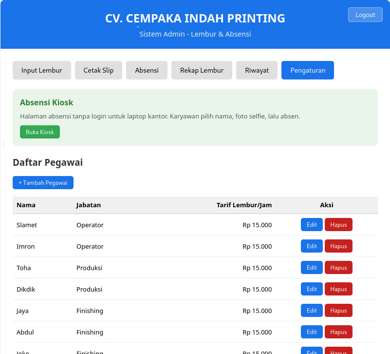
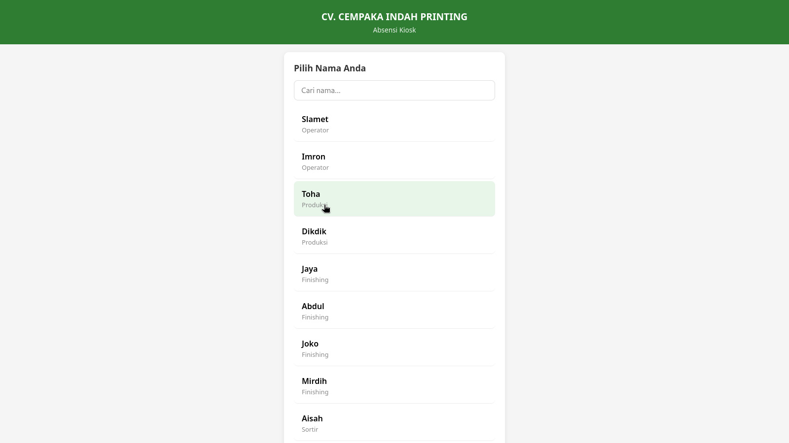

# Dokumentasi Sistem Absensi & Penggajian
# CV. Cempaka Indah Printing

**Versi:** 2.1.0
**Terakhir Diperbarui:** 22 Februari 2026

**Author : ihsan**

**Co-Authored & Documented By : Claude Opus 4.6**

---

## Daftar Isi

1. [Gambaran Umum](#1-gambaran-umum)
2. [Arsitektur Sistem](#2-arsitektur-sistem)
3. [Persyaratan Sistem](#3-persyaratan-sistem)
4. [Instalasi & Setup](#4-instalasi--setup)
5. [Menjalankan Aplikasi](#5-menjalankan-aplikasi)
6. [Panduan Penggunaan](#6-panduan-penggunaan)
7. [API Reference](#7-api-reference)
8. [Struktur Data & File](#8-struktur-data--file)
9. [Konfigurasi](#9-konfigurasi)
10. [Manajemen Karyawan](#10-manajemen-karyawan)
11. [Keamanan](#11-keamanan)
12. [Troubleshooting](#12-troubleshooting)
13. [Pengembangan Lanjutan](#13-pengembangan-lanjutan)

---

## 1. Gambaran Umum

Sistem ini adalah aplikasi manajemen kehadiran (absensi) dan penggajian untuk **CV. Cempaka Indah Printing**. Terdiri dari dua aplikasi web terpisah yang saling berbagi data:

| Aplikasi | Port HTTP | Port HTTPS | Fungsi Utama |
|----------|-----------|------------|--------------|
| **Admin App** | 3000 | 3443 | Absensi (QR + selfie), input lembur, cetak slip lembur, manajemen karyawan |
| **HRD App** | 3001 | — | Pembuatan slip gaji bulanan, rekap penggajian |

### Fitur Utama

- **Autentikasi** — Login berbasis session dengan password bcrypt-hashed
- **Absensi QR Code** — Karyawan scan QR dari HP, ambil selfie, lalu clock-in/out (HTTPS diperlukan untuk akses kamera)
- **Mode Kiosk** — Halaman absensi mandiri untuk laptop bersama di kantor
- **Absensi Admin** — Admin bisa clock-in/out karyawan langsung dari dashboard
- **Lembur** — Input data lembur dan cetak slip PDF mingguan
- **Slip Gaji** — Pembuatan slip gaji PDF + rekap Excel bulanan
- **Manajemen Karyawan** — Tambah, edit, hapus karyawan dari dashboard (termasuk gaji pokok)
- **Konfigurasi Jam Kerja** — Atur jam masuk/pulang dari dashboard
- **Auto-Backup** — Backup otomatis saat startup (5 backup terakhir disimpan)
- **Password Hashing** — Password otomatis di-hash saat pertama kali dijalankan
- **Riwayat File** — Lihat dan download semua file yang telah dibuat
- **Multi-platform** — Berjalan di Windows dan Linux
- **Akses Jaringan** — Kedua server bind ke `0.0.0.0`, bisa diakses dari HP/laptop lain di LAN

---

## 2. Arsitektur Sistem

### Diagram Alur

```
                    +-------------------+
                    |   Shared_Data/    |
                    |                   |
                    |  Config/          |
                    |   config.json     |
                    |   employees.json  |
                    |                   |
                    |  Absensi/         |
                    |   Foto/           |
                    |  Lembur_Mingguan/ |
                    |  Gaji/            |
                    |  Backups/         |
                    |  logo/            |
                    +--------+----------+
                             |
                    (baca & tulis)
                             |
              +--------------+--------------+
              |                             |
     +--------+--------+          +--------+--------+
     |   Admin App      |          |    HRD App       |
     |   HTTP :3000     |          |    HTTP :3001     |
     |   HTTPS :3443    |          |                   |
     |                  |          | - Slip Gaji       |
     | - Absensi QR     |          | - Rekap Excel     |
     | - Mode Kiosk     |          | - Riwayat File    |
     | - Input Lembur   |          | - Update Gaji     |
     | - Cetak Slip PDF |          |   Pokok           |
     | - Kelola Karyawan|          | - Ringkasan       |
     | - Konfigurasi    |          |   Lembur          |
     | - Auto-Backup    |          +------------------+
     +------------------+
```

### Teknologi yang Digunakan

| Komponen | Teknologi |
|----------|-----------|
| Backend | Node.js v20 + Express.js |
| Process Manager | pm2 (background service + auto-start) |
| Frontend | HTML + CSS + Vanilla JavaScript |
| Autentikasi | express-session + cookie-parser + bcryptjs |
| PDF | PDFKit |
| Excel | ExcelJS |
| File System | fs-extra |
| HTTPS | Node.js https module + self-signed certificate |
| QR Code | qrcode (npm) |
| Database | File-based (JSON + Excel) — tanpa database server |

### Alur Data

1. **Admin App** mengumpulkan data absensi (jam masuk/pulang + foto selfie) dan data lembur, menyimpan ke file Excel di `Shared_Data/`
2. **HRD App** menerima data gaji melalui form, mengambil ringkasan lembur dari file Excel, menghasilkan slip PDF dan rekap Excel
3. Kedua aplikasi membaca daftar karyawan dari `Shared_Data/Config/employees.json`
4. Password di `config.json` otomatis di-hash dengan bcrypt saat pertama kali server dijalankan

---

## 3. Persyaratan Sistem

### Software yang Diperlukan

- **Node.js v20** (versi LTS — **jangan gunakan versi terbaru/v22+**, pm2 belum stabil di versi tersebut)
- **npm** (terinstal bersama Node.js)
- **openssl** (untuk generate sertifikat HTTPS)
- **Browser modern** (Chrome, Firefox, Edge)

> **PENTING:** Gunakan **Node.js v20.x.x** (LTS). Versi terbaru (v22, v23, dsb) menyebabkan pm2 tidak stabil dan bisa crash. Download v20 di: https://nodejs.org/download/release/latest-v20.x/

### Cara Cek Versi

```bash
node --version    # Harus: v20.x.x
npm --version     # Minimal: v9.x.x
openssl version   # Cek apakah openssl terinstall
```

### Instalasi Software

#### Windows (Langkah demi Langkah)

1. **Install Node.js v20**
   - Download **Node.js v20 LTS** dari: https://nodejs.org/download/release/latest-v20.x/
   - Pilih file `node-v20.xx.x-x64.msi` (Windows 64-bit installer)
   - Jalankan installer, centang semua opsi default
   - **PENTING:** Jika sudah ada Node.js versi lain, uninstall dulu dari Control Panel sebelum install v20
   - Setelah selesai, buka **Command Prompt** dan verifikasi:
     ```cmd
     node --version
     npm --version
     ```
   - Pastikan output menunjukkan `v20.x.x`

2. **Install Git for Windows** (diperlukan untuk OpenSSL dan script .sh)
   - Download dari https://git-scm.com/download/win
   - Install dengan opsi default
   - OpenSSL sudah termasuk di dalamnya
   - Setelah install, **Git Bash** akan tersedia untuk menjalankan script `.sh`

#### Linux (Debian/Ubuntu/Kali)

```bash
# Install Node.js v20 via NodeSource
curl -fsSL https://deb.nodesource.com/setup_20.x | sudo -E bash -
sudo apt install -y nodejs openssl

# Verifikasi
node --version    # Harus: v20.x.x
npm --version
openssl version
```

---

## 4. Instalasi & Setup

### Langkah 1: Siapkan Folder Proyek

Pastikan struktur folder berikut sudah tersedia:

```
Absensi_CV_Cempaka_Indah_2025/
├── Admin_App/
├── HRD_App/
└── Shared_Data/
    ├── Config/
    ├── Absensi/
    │   └── Foto/
    ├── Lembur_Mingguan/
    ├── Gaji/
    ├── Backups/
    └── logo/
```

### Langkah 2: Install Dependencies

#### Windows (Command Prompt)
```cmd
cd Admin_App
npm install

cd ..\HRD_App
npm install
```

#### Linux (Terminal)
```bash
cd Admin_App
npm install

cd ../HRD_App
npm install
```

### Langkah 3: Install pm2 (Background Service)

pm2 adalah process manager yang membuat aplikasi **tetap berjalan di background** meskipun terminal ditutup, dan **otomatis jalan saat laptop dinyalakan**. Ini mencegah karyawan menghentikan aplikasi.

#### Windows (Cara Cepat — Direkomendasikan)
```
Klik kanan file install_service.bat → "Run as administrator"
```
Script ini otomatis menginstall pm2, menjalankan kedua app, dan mengatur auto-start.

#### Windows (Manual)
```cmd
npm install -g pm2
npm install -g pm2-windows-startup
```

#### Linux
```bash
sudo npm install -g pm2
```

### Langkah 4: Generate Sertifikat HTTPS

Sertifikat HTTPS **wajib** agar fitur QR absensi dengan kamera HP bisa berfungsi. Browser modern memblokir akses kamera dari halaman non-HTTPS.

#### Windows

**Opsi 1 — Klik dua kali:**
```
Buka folder Admin_App, klik dua kali file: generate_cert.bat
```

**Opsi 2 — Via Command Prompt:**
```cmd
cd Admin_App
generate_cert.bat
```

**Opsi 3 — Via Git Bash (jika sudah install Git for Windows):**
```bash
cd Admin_App
./generate_cert.sh
```

#### Linux
```bash
cd Admin_App
./generate_cert.sh
```

Jika error permission:
```bash
chmod +x generate_cert.sh
./generate_cert.sh
```

#### Apa yang dilakukan script ini:
- Mendeteksi IP LAN laptop secara otomatis
- Membuat sertifikat self-signed yang berlaku **365 hari**
- Menyimpan file ke `Admin_App/certs/key.pem` dan `Admin_App/certs/cert.pem`
- Sertifikat mencakup IP LAN dan localhost sebagai Subject Alternative Names
- Bertanya dulu sebelum menimpa sertifikat yang sudah ada

> **Catatan:** Jika IP LAN laptop berubah (misalnya pindah jaringan WiFi), jalankan ulang script ini untuk generate sertifikat baru dengan IP yang benar.

### Langkah 5: Verifikasi Konfigurasi

File `Shared_Data/Config/config.json` berisi kredensial login. Saat pertama kali server dijalankan, password plaintext akan otomatis di-hash dengan bcrypt:

```json
{
  "admin_username": "admin",
  "admin_password": "Admin2025",
  "hrd_username": "hrd",
  "hrd_password": "HRD2025"
}
```

Setelah server pertama kali jalan, password berubah menjadi hash bcrypt (`$2b$10$...`). Ini normal dan meningkatkan keamanan.

### Langkah 6 (Opsional): Logo Perusahaan

Untuk menampilkan logo di slip lembur dan slip gaji, letakkan file logo di:
```
Shared_Data/logo/Cempaka_indah_logo.jpg
```

Logo akan muncul di pojok kiri atas setiap slip PDF.

---

## 5. Menjalankan Aplikasi

Aplikasi dijalankan menggunakan **pm2** agar tetap berjalan di background — terminal boleh ditutup dan aplikasi tetap aktif. Aplikasi juga otomatis jalan saat laptop dinyalakan.

### Windows — Pertama Kali (Install Service)

1. Klik kanan `install_service.bat` → **"Run as administrator"**
2. Tunggu sampai selesai — kedua app langsung berjalan di background
3. **Selesai!** Terminal boleh ditutup. Aplikasi tetap jalan.

Setelah install, aplikasi akan **otomatis jalan setiap kali laptop dinyalakan** tanpa perlu melakukan apa-apa.

### Linux — Pertama Kali (Install Service)

```bash
chmod +x install_service.sh
./install_service.sh
```

Ikuti instruksi di layar. Jika diminta menjalankan perintah `sudo env PATH=...`, copy dan jalankan untuk mengaktifkan auto-start saat boot.

### Mengelola Aplikasi dengan pm2

Setelah install service, gunakan perintah pm2 untuk mengelola aplikasi. Buka **Command Prompt as Administrator** (Windows) atau terminal (Linux):

| Perintah | Fungsi |
|----------|--------|
| `pm2 status` | Cek status kedua aplikasi (online/stopped/error) |
| `pm2 logs` | Lihat log real-time (tekan Ctrl+C untuk keluar) |
| `pm2 logs admin-app` | Lihat log Admin App saja |
| `pm2 logs hrd-app` | Lihat log HRD App saja |
| `pm2 restart all` | Restart kedua aplikasi |
| `pm2 restart admin-app` | Restart Admin App saja |
| `pm2 stop all` | Hentikan kedua aplikasi |
| `pm2 start all` | Jalankan kedua aplikasi |

### Akses Aplikasi

Setelah kedua app berjalan, cek IP LAN dengan:
```cmd
pm2 logs admin-app --lines 5
```

| Aplikasi | URL Lokal | URL Jaringan (contoh) |
|----------|-----------|-----------------------|
| Admin App (HTTP) | http://localhost:3000 | http://192.168.1.100:3000 |
| Admin App (HTTPS) | https://localhost:3443 | https://192.168.1.100:3443 |
| HRD App | http://localhost:3001 | http://192.168.1.100:3001 |

**Penting:** Untuk akses dari HP (QR absensi), gunakan URL **HTTPS** (port 3443). Browser HP akan menampilkan peringatan sertifikat — klik "Advanced" → "Proceed" untuk melanjutkan.

### Menghentikan / Uninstall Service

Jika ingin menghapus service sepenuhnya:

**Windows:** Klik kanan `uninstall_service.bat` → "Run as administrator"

**Linux:**
```bash
pm2 stop all
pm2 delete all
pm2 save --force
pm2 unstartup
```

### Cara Lama (Tanpa pm2)

Jika karena alasan tertentu tidak bisa menggunakan pm2, aplikasi masih bisa dijalankan secara manual dengan `npm start`. Namun **aplikasi akan berhenti jika terminal ditutup**.

**Windows:**
- Klik dua kali `Admin_App\start_admin.bat` dan `HRD_App\start_hrd.bat`
- **Jangan tutup** jendela terminal

**Linux:**
```bash
cd Admin_App && npm start    # Terminal 1
cd HRD_App && npm start      # Terminal 2
```

---

## 6. Panduan Penggunaan

### 6.1 Login

Saat pertama kali membuka aplikasi, Anda akan diarahkan ke halaman login.

**Admin App:**
- Username: `admin`
- Password: `Admin2025`

**HRD App:**
- Username: `hrd`
- Password: `HRD2025`

Setelah login berhasil, Anda akan masuk ke halaman utama. Session berlaku selama **8 jam**, setelah itu perlu login ulang.

Untuk keluar, klik tombol **Logout** di pojok kanan atas header.

---

### 6.2 Absensi Harian (Admin App)

Fitur absensi tersedia di tab **"Absensi"** pada Admin App.

#### 6.2.1 Absensi oleh Admin

Admin bisa langsung mencatat kehadiran karyawan dari dashboard:

1. Buka tab **Absensi**
2. Temukan nama karyawan di grid
3. Klik tombol **Masuk** untuk clock-in atau **Pulang** untuk clock-out
4. Sistem mencatat waktu secara otomatis

#### 6.2.2 Absensi Mandiri via QR Code (Self-Service)

Karyawan bisa absen sendiri menggunakan HP:

1. Admin klik **Generate QR Code** di halaman Absensi
2. QR Code ditampilkan di layar — karyawan scan dengan HP
3. HP membuka halaman absensi via HTTPS (diperlukan untuk akses kamera)
4. Karyawan pilih nama, ambil foto selfie, lalu klik Masuk/Pulang
5. Foto selfie tersimpan di `Shared_Data/Absensi/Foto/`

**Token QR:** QR code berisi token unik yang bisa di-regenerate oleh admin kapan saja. Token tidak expired otomatis — admin mengontrol kapan token diganti.

#### 6.2.3 Mode Kiosk

Halaman khusus untuk laptop bersama di kantor (`/kiosk.html`):
(silahkan buka di pengaturan) dan klik "Buka Kiosk"

- Tidak perlu login admin
- Menampilkan daftar karyawan
- Karyawan pilih nama dan absen langsung



#### Status Kehadiran

| Badge | Warna | Keterangan |
|-------|-------|------------|
| Belum Hadir | Abu-abu | Belum absen masuk |
| Hadir | Hijau | Sudah absen masuk, belum pulang |
| Sudah Pulang | Biru | Sudah absen masuk dan pulang |

#### Aturan Absensi

- Setiap karyawan hanya bisa absen masuk **sekali per hari**
- Absen pulang hanya bisa dilakukan setelah absen masuk
- Data tersimpan di file Excel: `Shared_Data/Absensi/Absensi_[Bulan]_[Tahun].xlsx`
- Foto selfie tersimpan di: `Shared_Data/Absensi/Foto/[Nama]_[Tanggal]_[Action]_[Jam].jpg`

---

### 6.3 Input Data Lembur (Admin App)

Tersedia di tab **"Input Lembur"**.

#### Langkah:

1. Pilih **Nama Pegawai** dari dropdown
2. Pilih **Tanggal** lembur
3. Isi **Jam Mulai** dan **Jam Selesai** (opsional)
4. Isi **Upah Lembur** dalam Rupiah
5. Klik **Simpan Data Lembur**

Data akan ditambahkan ke file `Shared_Data/Lembur_Mingguan/Rekap_Lembur_Mingguan.xlsx`.

#### Kalkulasi Lembur Otomatis

Admin App menyediakan endpoint untuk menghitung ringkasan lembur per bulan:
- `GET /api/lembur/calculate/:month/:year` — menghitung total jam dan upah lembur dari rekap

---

### 6.4 Cetak Slip Lembur Mingguan (Admin App)

Tersedia di tab **"Cetak Slip"**.

#### Komponen Slip Lembur:

| Field | Keterangan |
|-------|------------|
| Uang Makan Harian | Tunjangan makan per hari (Rp) |
| Hari Kerja | Jumlah hari kerja dalam periode |
| Total Uang Makan | Otomatis: Uang Makan x Hari Kerja |
| Kerajinan | Bonus kerajinan (Rp) |
| Bensin | Tunjangan transportasi (Rp) |
| Pulsa | Tunjangan komunikasi (Rp) |
| Makan Lembur | Uang makan saat lembur (Rp) |
| Lembur Libur | Upah lembur hari libur (Rp) |
| Kasbon | Potongan kasbon/pinjaman (Rp) |
| Total Diterima | Otomatis dihitung |
| Keterangan | Catatan tambahan |

#### Langkah:

1. Pilih **Nama Pegawai**
2. Isi semua komponen tunjangan
3. Total akan dihitung otomatis: `(Total Makan + Kerajinan + Bensin + Pulsa + Makan Lembur + Lembur Libur) - Kasbon`
4. Klik **Cetak Slip PDF**

File PDF tersimpan di `Shared_Data/Lembur_Mingguan/Slip_Lembur_[Nama]_[Tanggal].pdf`.

---

### 6.5 Buat Slip Gaji Bulanan (HRD App)

Tersedia di tab **"Buat Slip Gaji"** pada HRD App.

#### Komponen Pendapatan:

| Field | Keterangan |
|-------|------------|
| Gaji Pokok | Gaji dasar bulanan (dari data karyawan) |
| THR | Tunjangan Hari Raya |
| Lembur Bulanan | Total lembur sebulan (bisa diambil otomatis dari data lembur) |
| Pembayaran Mingguan | Total pembayaran mingguan yang sudah diberikan |
| Tunjangan 1-4 | Tunjangan tambahan lainnya |

#### Komponen Potongan:

| Field | Keterangan |
|-------|------------|
| BPJS Ketenagakerjaan | Potongan BPJS TK |
| BPJS Kesehatan | Potongan BPJS Kesehatan |
| Pinjaman | Potongan pinjaman/cicilan |
| Potongan Lain | Potongan tambahan lainnya |

#### Langkah:

1. Pilih **Nama Pegawai**
2. Isi semua komponen **Pendapatan**
3. Isi semua komponen **Potongan**
4. **Total Take Home Pay** dihitung otomatis: `Total Pendapatan - Total Potongan`
5. Klik **Buat Slip Gaji (PDF + Excel)**

Sistem akan menghasilkan:
- **File PDF:** `Shared_Data/Gaji/Slip_Gaji_[Nama]_[Periode].pdf`
- **File Excel (Rekap):** `Shared_Data/Gaji/Rekap_Gaji_[Periode].xlsx`

Setiap karyawan yang dibuatkan slip akan ditambahkan sebagai baris baru di rekap Excel bulanan.

#### Ringkasan Lembur

HRD App bisa mengambil ringkasan lembur karyawan dari data Admin App:
- `GET /api/overtime-summary/:nama/:month/:year`
- Menampilkan total jam, total upah, dan detail per hari

---

### 6.6 Manajemen Karyawan (Admin App)

Admin bisa mengelola daftar karyawan langsung dari dashboard.

#### Tambah Karyawan
- `POST /api/config/employees` dengan `{nama, jabatan, tarif_lembur, gaji_pokok}`

#### Edit Karyawan
- `PUT /api/config/employees/:nama` — update jabatan, tarif_lembur, gaji_pokok

#### Hapus Karyawan
- `DELETE /api/config/employees/:nama` — hapus dari daftar (data historis tetap tersimpan)

#### Update Gaji Pokok (HRD App)
- `PUT /api/config/employees/:nama` — update gaji_pokok karyawan

---

### 6.7 Konfigurasi Jam Kerja (Admin App)

Admin bisa melihat dan mengubah jam kerja dari dashboard:
- `GET /api/config/settings` — lihat konfigurasi jam kerja
- `PUT /api/config/settings` — update jam kerja

---

### 6.8 Riwayat & Download File

Tersedia di tab **"Riwayat"** pada kedua aplikasi.

- **Admin App** menampilkan file dari folder `Lembur_Mingguan/`
- **HRD App** menampilkan file dari folder `Gaji/`

Setiap file ditampilkan dengan:
- Nama file
- Ukuran file
- Tanggal terakhir diubah
- Tombol **Download**

Klik **Refresh** untuk memperbarui daftar file.

---

## 7. API Reference

Semua endpoint API memerlukan autentikasi (session aktif) kecuali yang ditandai.

### Admin App (Port 3000)

#### Autentikasi

| Method | Endpoint | Auth | Deskripsi | Body |
|--------|----------|------|-----------|------|
| POST | `/api/login` | - | Login | `{username, password}` |
| POST | `/api/logout` | Ya | Logout | — |

#### Karyawan

| Method | Endpoint | Auth | Deskripsi |
|--------|----------|------|-----------|
| GET | `/api/employees` | Ya | Daftar seluruh karyawan |
| GET | `/api/kiosk/employees` | - | Daftar karyawan (untuk kiosk) |
| GET | `/api/absensi/employees?token=xxx` | Token | Daftar karyawan (untuk QR self-service) |

#### Manajemen Karyawan

| Method | Endpoint | Auth | Deskripsi |
|--------|----------|------|-----------|
| POST | `/api/config/employees` | Ya | Tambah karyawan baru |
| PUT | `/api/config/employees/:nama` | Ya | Edit karyawan |
| DELETE | `/api/config/employees/:nama` | Ya | Hapus karyawan |

#### Konfigurasi

| Method | Endpoint | Auth | Deskripsi |
|--------|----------|------|-----------|
| GET | `/api/config/settings` | Ya | Lihat jam kerja |
| PUT | `/api/config/settings` | Ya | Update jam kerja |

#### Lembur

| Method | Endpoint | Auth | Deskripsi | Body |
|--------|----------|------|-----------|------|
| POST | `/api/lembur/save` | Ya | Simpan data lembur | `{nama, tanggal, jam_mulai, jam_selesai, upah_lembur}` |
| POST | `/api/lembur/pdf` | Ya | Buat slip PDF lembur | `{nama, data: [...]}` |
| GET | `/api/lembur/calculate/:month/:year` | Ya | Hitung ringkasan lembur | — |
| POST | `/api/lembur/auto-save/:month/:year` | Ya | Auto-save lembur bulanan | — |

#### Absensi

| Method | Endpoint | Auth | Deskripsi | Body |
|--------|----------|------|-----------|------|
| POST | `/api/absensi/masuk` | Ya | Clock in (admin) | `{nama}` |
| POST | `/api/absensi/pulang` | Ya | Clock out (admin) | `{nama}` |
| POST | `/api/absensi/scan` | Token | Clock in/out self-service | `{nama, token, action, foto}` |
| POST | `/api/kiosk/scan` | - | Clock in/out kiosk | `{nama, action, foto}` |
| GET | `/api/absensi/today` | Ya | Absensi hari ini | — |
| GET | `/api/absensi/recap/:month/:year` | Ya | Rekap bulanan | — |
| GET | `/api/absensi/qrcode` | Ya | Generate QR code | — |
| POST | `/api/absensi/regenerate-token` | Ya | Regenerate token absensi | — |
| GET | `/api/absensi/foto` | Ya | Daftar foto selfie | — |
| GET | `/api/absensi/foto/:filename` | Ya | Download foto selfie | — |

#### File

| Method | Endpoint | Auth | Deskripsi |
|--------|----------|------|-----------|
| GET | `/api/files/lembur` | Ya | Daftar file lembur |
| GET | `/api/files/download/:filename` | Ya | Download file |

#### Halaman Publik (tanpa login)

| URL | Deskripsi |
|-----|-----------|
| `/login.html` | Halaman login |
| `/absensi.html` | Halaman absensi self-service (QR) |
| `/kiosk.html` | Halaman kiosk untuk laptop kantor |

---

### HRD App (Port 3001)

#### Autentikasi

| Method | Endpoint | Auth | Deskripsi | Body |
|--------|----------|------|-----------|------|
| POST | `/api/login` | - | Login | `{username, password}` |
| POST | `/api/logout` | Ya | Logout | — |

#### Karyawan

| Method | Endpoint | Auth | Deskripsi |
|--------|----------|------|-----------|
| GET | `/api/employees` | Ya | Daftar karyawan dengan gaji_pokok |
| PUT | `/api/config/employees/:nama` | Ya | Update gaji_pokok |

#### Slip Gaji

| Method | Endpoint | Auth | Deskripsi |
|--------|----------|------|-----------|
| POST | `/api/gaji/slip` | Ya | Buat slip gaji (PDF + Excel) |

**Request Body:**
```json
{
  "nama": "Slamet",
  "data": {
    "gaji_pokok": 2500000,
    "thr": 0,
    "lembur_bulanan": 150000,
    "pembayaran_mingguan": 300000,
    "tunjangan1": 0,
    "tunjangan2": 0,
    "tunjangan3": 0,
    "tunjangan4": 0,
    "bpjs_tk": 50000,
    "bpjs_kes": 25000,
    "pinjaman": 0,
    "potongan_lain": 0
  }
}
```

#### Lembur

| Method | Endpoint | Auth | Deskripsi |
|--------|----------|------|-----------|
| GET | `/api/overtime-summary/:nama/:month/:year` | Ya | Ringkasan lembur karyawan |

#### File

| Method | Endpoint | Auth | Deskripsi |
|--------|----------|------|-----------|
| GET | `/api/files/gaji` | Ya | Daftar file gaji |
| GET | `/api/files/download/:filename` | Ya | Download file |

---

## 8. Struktur Data & File

### Struktur Folder Shared_Data

```
Shared_Data/
├── Config/
│   ├── config.json          # Konfigurasi sistem (password di-hash otomatis)
│   ├── employees.json       # Daftar karyawan
│   └── jam_kerja.xlsx       # Referensi jam kerja
│
├── Absensi/                  # Data kehadiran
│   ├── Absensi_Februari_2026.xlsx
│   ├── Foto/                 # Foto selfie karyawan
│   │   ├── Slamet_2026-02-20_masuk_0805.jpg
│   │   └── ...
│   └── ...
│
├── Lembur_Mingguan/          # Data lembur & slip
│   ├── Rekap_Lembur_Mingguan.xlsx
│   ├── Slip_Lembur_Slamet_20-2-2026.pdf
│   └── ...
│
├── Gaji/                     # Slip gaji & rekap
│   ├── Rekap_Gaji_Februari_2026.xlsx
│   ├── Slip_Gaji_Slamet_Februari_2026.pdf
│   └── ...
│
├── Backups/                  # Backup otomatis (5 terakhir)
│   ├── backup_2026-02-21_16_18_43/
│   └── ...
│
└── logo/                     # Logo perusahaan
    └── Cempaka_indah_logo.jpg
```

### Format File Excel

#### Absensi (`Absensi_[Bulan]_[Tahun].xlsx`)

| Kolom | Header | Contoh |
|-------|--------|--------|
| A | Tanggal | 20/2/2026 |
| B | Nama | Slamet |
| C | Jam Masuk | 08.05 |
| D | Jam Pulang | 17.02 |
| E | Status | Hadir |

#### Rekap Lembur (`Rekap_Lembur_Mingguan.xlsx`)

| Kolom | Header | Contoh |
|-------|--------|--------|
| A | Nama | Slamet |
| B | Tanggal | 2026-02-15 |
| C | Jam Mulai | 17:00 |
| D | Jam Selesai | 20:00 |
| E | Upah Lembur (Rp) | 150000 |

#### Rekap Gaji (`Rekap_Gaji_[Periode].xlsx`)

| Kolom | Header |
|-------|--------|
| A | Nama |
| B | Gaji Pokok |
| C | THR |
| D | Lembur Bulanan |
| E | Pembayaran Mingguan |
| F-I | Tunjangan 1-4 |
| J | BPJS TK |
| K | BPJS Kesehatan |
| L | Pinjaman |
| M | Potongan Lain |
| N | Total Take Home Pay |

### Konvensi Penamaan File

| Tipe | Pola Nama |
|------|-----------|
| Absensi | `Absensi_[NamaBulan]_[Tahun].xlsx` |
| Foto Selfie | `[Nama]_[Tanggal]_[Action]_[Jam].jpg` |
| Slip Lembur | `Slip_Lembur_[Nama]_[Tanggal].pdf` |
| Rekap Lembur | `Rekap_Lembur_Mingguan.xlsx` |
| Slip Gaji | `Slip_Gaji_[Nama]_[Periode].pdf` |
| Rekap Gaji | `Rekap_Gaji_[Periode].xlsx` |

---

## 9. Konfigurasi

### File: `Shared_Data/Config/config.json`

```json
{
  "wifi_ssid": "cip-B15N15",
  "wifi_password": "cempaka2025",
  "admin_username": "admin",
  "admin_password": "$2b$10$...(hashed)...",
  "hrd_username": "hrd",
  "hrd_password": "$2b$10$...(hashed)...",
  "backup_time": "17:30",
  "rekap_weekly_time": "17:30",
  "rekap_weekly_day": "Saturday",
  "jam_kerja": {
    "senin_jumat": {"masuk": "08:00", "pulang": "15:41"},
    "sabtu": {"masuk": "08:00", "pulang": "15:00"}
  }
}
```

### Penjelasan Parameter

| Parameter | Tipe | Keterangan |
|-----------|------|------------|
| `wifi_ssid` | string | Nama jaringan WiFi kantor |
| `wifi_password` | string | Password WiFi kantor |
| `admin_username` | string | Username login Admin App |
| `admin_password` | string | Password (di-hash otomatis dengan bcrypt) |
| `hrd_username` | string | Username login HRD App |
| `hrd_password` | string | Password (di-hash otomatis dengan bcrypt) |
| `backup_time` | string | Waktu backup harian (HH:MM) |
| `rekap_weekly_time` | string | Waktu rekap mingguan (HH:MM) |
| `rekap_weekly_day` | string | Hari rekap mingguan |
| `jam_kerja` | object | Jam kerja karyawan |

### Mengubah Password

1. Edit `config.json`
2. Ganti hash password dengan password baru dalam **plaintext**:
   ```json
   "admin_password": "PasswordBaru123"
   ```
3. Restart server:
   ```cmd
   pm2 restart all
   ```
4. Password akan otomatis di-hash ulang — login dengan password baru

### Jam Kerja

Jam kerja bisa diubah dari dashboard Admin App atau langsung di `config.json`:
- **Senin - Jumat:** 08:00 - 15:41
- **Sabtu:** 08:00 - 15:00

---

## 10. Manajemen Karyawan

### File: `Shared_Data/Config/employees.json`

Berisi array objek karyawan:

```json
[
  {"nama": "Slamet", "jabatan": "Operator", "tarif_lembur": 15000, "gaji_pokok": 2000000},
  {"nama": "Imron", "jabatan": "Operator", "tarif_lembur": 15000, "gaji_pokok": 10000}
]
```

### Field Karyawan

| Field | Tipe | Keterangan |
|-------|------|------------|
| `nama` | string | Nama lengkap karyawan (unik, digunakan sebagai ID) |
| `jabatan` | string | Jabatan/posisi |
| `tarif_lembur` | number | Tarif lembur per jam (Rp) |
| `gaji_pokok` | number | Gaji pokok bulanan (Rp) |

### Daftar Karyawan Saat Ini

| Nama | Jabatan | Tarif Lembur | Gaji Pokok |
|------|---------|-------------|------------|
| Slamet | Operator | 15.000 | 2.000.000 |
| Imron | Operator | 15.000 | 10.000 |
| Toha | Produksi | 15.000 | 0 |
| Dikdik | Produksi | 15.000 | 0 |
| Jaya | Finishing | 15.000 | 0 |
| Abdul | Finishing | 15.000 | 0 |
| Joko | Finishing | 15.000 | 1.000.000 |
| Mirdih | Finishing | 15.000 | 0 |
| Aisah | Sortir | 15.000 | 0 |
| Inna | Sortir | 15.000 | 0 |
| Richard | Finishing | 15.000 | 0 |
| Retno | Desain Produksi | 15.000 | 5.000.000 |
| Hari | Admin Produksi | 15.000 | 0 |
| Ihsan | Node Operator | 15.000 | 0 |
| Irfan | Manager | 10.000 | 0 |
| hasan | ceo | 200.000 | 12.000.000 |
| Dummy1 | Latihan | 15.000 | 2.500.000 |
| Dummy2 | Latihan | 15.000 | 0 |

### Mengelola Karyawan

Karyawan bisa dikelola dengan 2 cara:

**Cara 1: Via Dashboard Admin App (direkomendasikan)**
- Tambah, edit, hapus langsung dari halaman web
- Perubahan langsung tersimpan ke `employees.json`

**Cara 2: Edit File Langsung**
1. Buka file `Shared_Data/Config/employees.json`
2. Tambah/edit/hapus objek karyawan
3. Simpan file
4. Refresh halaman web

Data historis karyawan (absensi, slip) tetap tersimpan meskipun karyawan dihapus dari daftar.

---

## 11. Keamanan

### Autentikasi

- Menggunakan **express-session** dengan cookie berbasis server
- Password di-hash dengan **bcrypt** (10 rounds) — tidak disimpan plaintext
- Migrasi otomatis: password plaintext di config.json akan di-hash saat server pertama kali jalan
- Session berlaku **8 jam** (`maxAge: 8 * 60 * 60 * 1000`)
- Setiap request ke `/api/*` memerlukan session aktif (kecuali endpoint publik)
- Request tanpa session mendapat response **HTTP 401 Unauthorized**
- Halaman web tanpa session diarahkan ke `/login.html`

### Token Absensi

- QR code berisi token unik (32 karakter hex) yang di-generate saat startup
- Token bisa di-regenerate kapan saja oleh admin
- Endpoint self-service (`/api/absensi/scan`, `/api/absensi/employees`) memvalidasi token
- Tanpa token yang valid, karyawan tidak bisa absen via QR

### HTTPS

- Admin App mendukung HTTPS (port 3443) menggunakan self-signed certificate
- Diperlukan agar browser mengizinkan akses kamera di HP untuk foto selfie
- Sertifikat di-generate dengan script `generate_cert.sh` (Linux) atau `generate_cert.bat` (Windows)

### Perlindungan File

- Download file menggunakan `path.basename()` untuk mencegah **path traversal attack**
- Hanya file di folder yang ditentukan yang bisa didownload

### Auto-Backup

- Backup otomatis dijalankan setiap kali Admin App dimulai
- Membackup folder: Config, Absensi, Lembur_Mingguan, Gaji
- Maksimal **5 backup** tersimpan — yang lebih lama otomatis dihapus
- Backup disimpan di `Shared_Data/Backups/backup_[timestamp]/`

### Kredensial Default

| App | Username | Password |
|-----|----------|----------|
| Admin | admin | Admin2025 |
| HRD | hrd | HRD2025 |

**Sangat disarankan** untuk mengganti password default sebelum digunakan di lingkungan produksi.

### Cara Ganti Password

1. Edit `config.json`, ganti hash dengan password plaintext baru
2. Restart server: `pm2 restart all`
3. Login dengan password baru

---

## 12. Troubleshooting

### Aplikasi Tidak Bisa Diakses

**Gejala:** Browser menampilkan "Connection refused" atau halaman kosong.

**Solusi:**
1. Cek apakah aplikasi berjalan:
   ```cmd
   pm2 status
   ```
2. Jika status `stopped` atau `errored`, restart:
   ```cmd
   pm2 restart all
   ```
3. Lihat log error:
   ```cmd
   pm2 logs --lines 20
   ```
4. Jika pm2 belum diinstall, jalankan ulang `install_service.bat` (Windows) atau `install_service.sh` (Linux) sebagai Administrator

### Port Sudah Digunakan (EADDRINUSE)

**Gejala:** Error `EADDRINUSE: address already in use 0.0.0.0:3000` di pm2 logs

**Solusi:**
```bash
# Cek apa yang menggunakan port
# Linux
ss -tlnp | grep -E '3000|3001'
fuser -k 3000/tcp

# Windows (Command Prompt as Admin)
netstat -ano | findstr :3000
taskkill /PID <PID_NUMBER> /F

# Lalu restart pm2
pm2 restart all
```

### Tidak Bisa Akses dari HP / Laptop Lain

**Gejala:** HP tidak bisa membuka URL Admin App.

**Solusi:**
1. Pastikan HP/laptop terhubung ke **WiFi yang sama** dengan laptop server
2. Gunakan IP LAN yang ditampilkan di console (bukan `localhost`)
3. Cek firewall tidak memblokir port 3000/3001/3443:

   **Windows:**
   - Buka **Windows Defender Firewall** → **Advanced Settings**
   - Klik **Inbound Rules** → **New Rule**
   - Pilih **Port** → **TCP** → isi `3000, 3001, 3443`
   - Pilih **Allow the connection** → centang semua profil → beri nama "Absensi App"
   - Atau via Command Prompt (run as Administrator):
     ```cmd
     netsh advfirewall firewall add rule name="Absensi App" dir=in action=allow protocol=TCP localport=3000,3001,3443
     ```

   **Linux:**
   ```bash
   sudo ufw allow 3000
   sudo ufw allow 3001
   sudo ufw allow 3443
   ```

### HTTPS / Kamera Tidak Berfungsi di HP

**Gejala:** Browser HP menolak akses kamera atau menampilkan peringatan keamanan.

**Solusi:**
1. Pastikan mengakses via **HTTPS** (port 3443), bukan HTTP
2. Saat peringatan sertifikat muncul, klik "Advanced" → "Proceed"
3. Jika sertifikat belum ada, generate dulu:
   - **Windows:** Klik dua kali `Admin_App\generate_cert.bat`
   - **Linux:** `cd Admin_App && ./generate_cert.sh`
4. Restart Admin App: `pm2 restart admin-app`

### Login Gagal

**Gejala:** Pesan "Username atau password salah"

**Solusi:**
1. Pastikan menggunakan kredensial yang benar
2. Jika password sudah di-hash (dimulai dengan `$2b$`), jangan copy hash — gunakan password plaintext
3. Untuk reset password: ganti hash di `config.json` dengan password plaintext baru, lalu `pm2 restart all`

### File Excel Error

**Gejala:** Error saat menyimpan atau membaca file Excel

**Solusi:**
1. Pastikan file Excel tidak sedang dibuka di program lain (Excel, LibreOffice)
2. Pastikan folder memiliki permission write
3. Jika file corrupt, hapus file Excel yang bermasalah — akan dibuat ulang otomatis

### npm install Gagal

**Gejala:** Error saat menjalankan `npm install`

**Solusi:**

**Linux:**
```bash
rm -rf node_modules package-lock.json
npm install
```

**Windows (Command Prompt):**
```cmd
rmdir /s /q node_modules
del package-lock.json
npm install
```

### Session Expired

**Gejala:** Tiba-tiba diminta login ulang

**Penyebab:** Session berlaku 8 jam. Setelah itu otomatis expired.

**Solusi:** Login ulang. Session akan diperpanjang 8 jam.

### pm2 Tidak Ditemukan

**Gejala:** `'pm2' is not recognized as an internal or external command`

**Solusi:**
1. Pastikan Node.js v20 sudah terinstall
2. Install pm2 ulang:
   ```cmd
   npm install -g pm2
   ```
3. Tutup dan buka ulang Command Prompt
4. Jika masih error, tambahkan npm global ke PATH:
   ```cmd
   npm config get prefix
   ```
   Tambahkan output path tersebut ke System Environment Variables → PATH

### pm2 App Status Error

**Gejala:** `pm2 status` menunjukkan status `errored`

**Solusi:**
1. Lihat error detail:
   ```cmd
   pm2 logs admin-app --lines 30
   pm2 logs hrd-app --lines 30
   ```
2. Perbaiki error, lalu restart:
   ```cmd
   pm2 restart all
   ```
3. Jika masih error, hapus dan install ulang:
   ```cmd
   pm2 delete all
   ```
   Lalu jalankan ulang `install_service.bat` sebagai Administrator

### Aplikasi Tidak Auto-Start Setelah Restart Laptop

**Gejala:** Setelah laptop direstart, aplikasi tidak berjalan

**Solusi (Windows):**
1. Buka Command Prompt as Administrator
2. Jalankan:
   ```cmd
   pm2 resurrect
   ```
3. Jika tidak berhasil, jalankan ulang `install_service.bat` sebagai Administrator

**Solusi (Linux):**
```bash
pm2 startup
# Jalankan perintah sudo yang ditampilkan
pm2 save
```

---

## 13. Pengembangan Lanjutan

### Menjalankan Test

HRD App menyediakan script test untuk memverifikasi pembuatan slip gaji:

```bash
cd HRD_App

# Pastikan HRD App sudah berjalan
npm start &

# Jalankan test (di terminal lain)
node test_slip.js
```

**Catatan:** Test script (`test_slip.js`) memanggil API tanpa autentikasi sehingga akan gagal (401) — ini membuktikan bahwa proteksi login berfungsi.

### Dependencies

#### Global (install sekali)
```
pm2                      — Process manager (background service + auto-start)
pm2-windows-startup      — Auto-start pm2 saat boot Windows
```

#### Admin App
```
bcryptjs         ^2.4.3    — Password hashing
cookie-parser    ^1.4.6    — Parsing cookie
express          ^4.19.2   — Web framework
express-session  ^1.18.0   — Session management
body-parser      ^1.20.3   — Parse JSON body
exceljs          ^4.4.0    — Baca/tulis Excel
pdfkit           ^0.15.0   — Generate PDF
fs-extra         ^11.2.0   — File system utilities
qrcode           ^1.5.4    — Generate QR code
```

#### HRD App
```
bcryptjs         ^2.4.3    — Password hashing
cookie-parser    ^1.4.6    — Parsing cookie
express          ^4.19.2   — Web framework
express-session  ^1.18.0   — Session management
body-parser      ^1.20.3   — Parse JSON body
exceljs          ^4.4.0    — Baca/tulis Excel
pdfkit           ^0.15.0   — Generate PDF
fs-extra         ^11.2.0   — File system utilities
```

### File Penting

| File | Fungsi |
|------|--------|
| `install_service.bat` | Install background service + auto-start (Windows) |
| `install_service.sh` | Install background service + auto-start (Linux) |
| `uninstall_service.bat` | Hapus background service (Windows) |
| `reset_data.bat` | Reset semua data ke kondisi bersih (Windows) |
| `reset_data.sh` | Reset semua data ke kondisi bersih (Linux) |
| `Admin_App/server.js` | Server utama Admin App |
| `Admin_App/generate_cert.sh` | Generate sertifikat HTTPS (Linux/Git Bash) |
| `Admin_App/generate_cert.bat` | Generate sertifikat HTTPS (Windows) |
| `Admin_App/certs/` | Folder sertifikat SSL |
| `Admin_App/public/index.html` | Dashboard admin |
| `Admin_App/public/login.html` | Halaman login |
| `Admin_App/public/absensi.html` | Halaman absensi self-service (QR) |
| `Admin_App/public/kiosk.html` | Halaman kiosk |
| `HRD_App/server.js` | Server utama HRD App |
| `HRD_App/public/index.html` | Dashboard HRD |
| `HRD_App/test_slip.js` | Script test slip gaji |

---

*Dokumentasi ini dibuat untuk membantu pengguna dan pengembang memahami, menjalankan, dan memelihara Sistem Absensi & Penggajian CV. Cempaka Indah Printing.*
